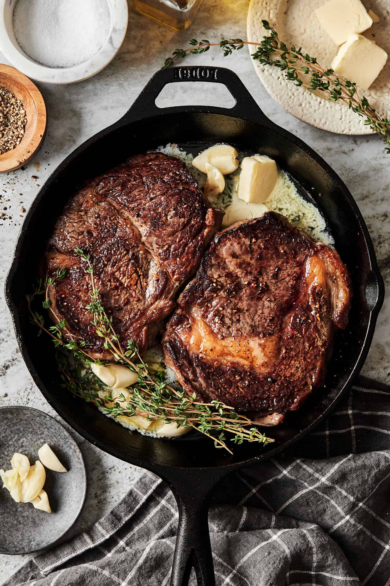

# **How to _actually_ Cook Good Steak**

_Fool proof way of cooking any thick cut of steak with simple ingredients. Great for special dinners or any ocassion!_

## Ingredients

- rib eye
- olive oil
- fresh garlic cloves
- rosemary
- thyme
- salt
- pepper
- unsalted butter

## Cooking Instructions

1. Let the steak thaw to room temperature before cooking. It usually takes around 30 minutes to an hour.
2. Generously season the steak with salt and pepper on all sides of the steak.
3. Preheat your skillet pan over high heat and add a few tablespoons of olive oil. Wait until the oil starts to shimmer before adding the steak. Start preheating your oven at 400F.
4. Place the steak flat onto the pan and let it sear for 2 minutes for a golden crust. Then, flip the steak over and sear it for another 30 seconds.
5. As you sear the other side of the steak, add 2 cloves of garlic, thyme, rosemary, and 3 tablespoons of unsalted butter to the pan.
6. Use a spoon to baste the butter over the steak for the next minute.
7. Transfer the pan into the oven and bake for another 4-10 minutes.
8. Take the steak out of the oven and let it rest for 5 minutes before serving.
